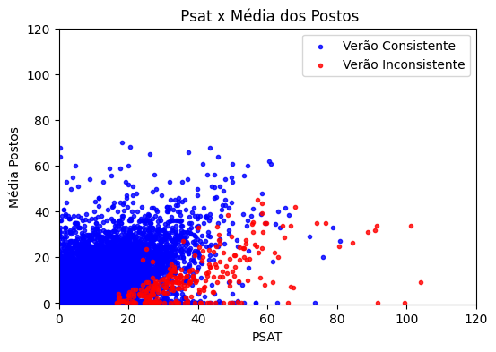
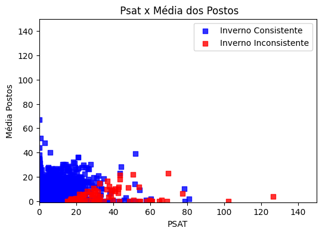
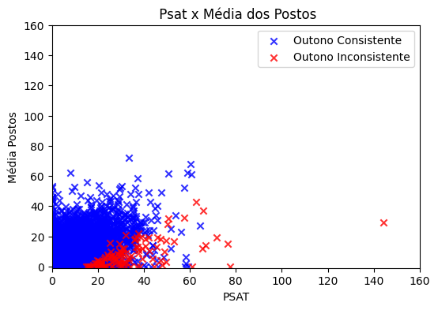

# Métodos de identificação automática de dados de estimativa de precipitação de satélite incosistentes

#### Aluno: Hugo Bernardo Barros Torraca (https://github.com/HugoTorraca)
#### Orientadora: Evelyn Batista (https://github.com/evysb).
---

Trabalho apresentado ao curso [BI MASTER](https://ica.puc-rio.ai/bi-master) como pré-requisito para conclusão de curso e obtenção de crédito na disciplina "Projetos de Sistemas Inteligentes de Apoio à Decisão".

---
# Resumo

A estimativa da precipitação observada em uma área ou bacia hidrográfica é um importante dado para diversos usos e aplicações. Contudo, a baixa densidade de postos pluviométricos em grande parte do Brasil dificulta a quantificação dessa variável. Para mitigar esse problema diversos usuários têm utilizado estimativas de satélite ou combinações entre precipitação de postos e satélites. Porém, essas estimativas possuem diversas imprecisões e muitas vezes superestimam o volume de chuva. Para facilitar a identificação de possíveis dados estimados espúrios esse trabalho propõe o uso de técnicas de classificação automática que indiquem dados suspeitos para posterior análise manual de um meteorologista. Os resultados indicam que os métodos conseguem sinalizar quase todos os dados espúrios com valores de Recall superiores a 0,95, no entanto eles também apresentam falsos positivos com precisões entre 0,25 e 0,3.  

# 1. Introdução

A precipitação é uma as variáveis meteorológicas mais utilizadas para os mais diversos fins no Brasil e sua correta mensuração é fundamental. Para o setor elétrico a precipitação observada é um insumo fundamental para realizar diagnóstico das bacias hidrográficas e auxiliar na previsão de vazão dos pontos de interesse.  Para garantir a qualidade desse dado os detentores de concessões de usinas hidrelétricas são obrigados a instalar estações pluviométricas ao longo da bacia hidrográfica, além disso outros órgãos também possuem postos nessas áreas o que contribuir para o adensamento da rede de pluviográfos. 

Contudo, a expansão do setor elétrico para a região Norte do País trouxe um desafio para a quantificação da chuva nessas bacias devido a diversos fatores dentre os quais podemos destacar:  o grande tamanho das bacias hidrográficas nessa região, grandes extensões da bacia serem pouco povoadas ou áreas de floresta que impedem a instalação e manutenção de estações e parte da área das bacias estar em outros Países. Para mitigar essa baixa qualidade o setor elétrico tem mesclado os dados de postos com estimativas de precipitação por satélite que calculam a precipitação com base em parâmetros das nuvens que estão sobre a região (PSAT).  Porém, a estimativa de satélite nessa região tem apresentado desvios, principalmente superestimando o volume precipitado em alguns momentos. A causa desse viés ainda não é clara e esse comportando não possui padrão definido o que torna difícil estimar uma equação de remoção de viés. 

Dessa forma, a equipe de meteorologia do Operador Nacional do Sistema Elétrico (ONS) muitas vezes é obrigada a analisar manualmente dados suspeitos para que possam corrigi-los. Essa atividade caso fosse realizada diariamente para todos os locais de interesse demoraria diversas horas e impactaria os demais processos da Organização. É necessário então a criação de uma ferramenta automática que faça uma triagem dos dados para que as equipes atuem apenas nos dados que possuam características suspeitas.  

Esse tipo de separação de dados pode se considerado um problema de classificação binária onde os dados suspeitos são categorizados como um grupo e os dados não suspeitos em outro.  Para realizar essa tarefa existem diversos algoritmos com diferentes abordagens e esse trabalho tem como objetivo estudar diferentes métodos de classificação para descobrir quais métodos possuem melhor resultado para a essa aplicação.

# 2. Modelagem

## 2.1 Dados de entrada

Para a criação da massa de dados foi utilizada a precipitação diária de diferentes locais das regiões Norte, Nordeste e Centro-Oeste que tinham sido previamente consistidos para uma atividade anterior do ONS de calibração de modelos de previsão de vazão totalizando 69.914 registros. Foram considerados como dados inconsistentes os dados dessa base no quais a média dos dados combinados de satélite e postos era superior à média pura dos postos e que houve uma redução de ao menos 15 mm entre o dado original da combinação com o dado consistido pela a equipe.  Essa escolha de considerar apenas os dados onde houve redução foi feita pois a superestimativa da precipitação, além de ser mais comum, é também o que causa maior impacto nos processos do ONS, principalmente a previsão de vazão. Dessa forma, dos 69914 registros 662 foram classificados como inconsistentes e o restante como consistente.

Para a criação do dataset foram consideradas as seguintes colunas:

* **Estacao:**	    Estação do ano 

* **Valor:**		precipitação estimada pela combinação de satélite e postos (mm/dia)

* **Valor _D-1**:	precipitação consistida do dia anterior (mm/dia)

* **m_postos:**	    média apenas dos postos pluviométricos (mm/dia)

* **Area:**		    Área da bacia hidrográfica ( km²)

* **P100:**		    Maior precipitação já registrada na bacia naquela estação do ano (mm/dia)

* **P95:** 		    Precipitação superada apenas 5% das vezes na bacia naquela estação do ano (mm/dia)

* **P90:**		    Precipitação superada apenas 10% das vezes na bacia naquela estação do ano (mm/dia)

## 2.2 Tratamento dos dados

O grande desbalanceamento dos dados pode causar problemas na divisão de treino/teste mesmo  que se utilize técnicas que mantenham a proporção de ambas as classes nos conjuntos. Para contornar isso cada modelo foi calibração e testado com 50 divisões (80-20) diferentes utilizando a função train_test_split do pacote sklearn cada um com uma semente própria, posteriomente cada conjunto de calibração passou por uma normatização utilizando a função  MinMaxScaler() do sklearn que normatiza cada coluna no intervalo [0 a 1]. 

Além disso, foram realizados 2 testes, no primeiro foi utilizada a base toda para classificação já na segunda a base foi pre processada e todos dados no quais a coluna valor era menor 15 e/ou que a coluna valor era menor que a coluna m_postos foram retirados da massa de calibração e na base de testes foram já automaticamente classificados como consistentes. 

## 2.3 Modelos

Para o teste dos modelos foram escolhidos 11 métodos mais comuns de classificação, a saber: 

**Kneighbors (KNN)** – É um dos algoritmos mais comuns de classificação, ele classificada cada dado de acordo com a classe dos seus n vizinhos mais próximos, no caso em estudo foram utilizados os 5 vizinhos mais próximos.

**Naive Bayes (GNB)** – Baseado no teorema de bayes é um classificador probabilístico que considera que cada atributo é independente e contribui para aumentar a probabilidade da amostra pertencer a uma classe. Para isso ele utiliza uma distribuição de probabilidade independente para cada atributo, no caso em estudo foram utilizadas distribuições gaussianas. 

**Decision Tree (DTC)** – A árvore de decisão é um método de classificação que separa o conjunto em subconjuntos utilizando regras lógicas que separem seus atributos visando máximizar/minimizar uma função objetivo. 

**Random Forest (RFC)** – Nesse método de classificação um conjunto de árvores de decisão são criados e a probabilidade do dado ser de uma classe pode ser entendido com o número de árvores que votaram naquela classe divido pelo número total de árvores, para obter diferentes árvores cada um dela recebe como treinamento um subset da massa original e também um subset dos parâmetros. 

**Linear Suport Vector Machine (SVM)** – O método de máquina de vetor linear busca encontrar o hiperplano que gera a maior separação entre os dados das duas distintas classes.  

**Regressão Logística (LRE)** - A regressão logística é um algoritmo de classificação que prevê a probabilidade de uma classe utilizando uma função logística que varia entre zero e um com base nas variáveis de entrada. 

**Bagging Decision Tree (BGT)** – O método de *bagging*, acrônimo para *bootstrep and aggregation*, assim como *random forest* é baseado na votação de diferentes modelos que são calibrados com subsets da massa de calibração original, porém nesse método dos os modelos recebem todos os atributos. 

**Boosting Decision Tree (BDT)** - Também utiliza diversas árvores de decisão, porém nele as árvores não são paralelas, mas em sequência onde cada árvore recebe o resíduo da anterior. 

**Classificador XGBoost (XGB)** -  Assim como o random forest utiliza diversas árvores de decisão, contudo a árvore utilizada, denominada CART tree (Classification and Regression trees) não divide em suas folhas os dados de forma categórica e sim de forma probabilística como cada nó atribuindo uma probabilidade de o dado pertencer a determinada classe.

**Classificador LightGBM (LGB)** -  Também é baseado em conjuntos de árvores de decisão, porém suas árvores são construídas “Leap wise”, ou seja, a árvore cresce apenas no ramo que causa a menor redução de perda global, ao contrário das árvores tradicionais  “Level wise” que a cada iteração todos os nós são divididos para diminuir a perda daquele ramo.

**Rede Neural (RNE)** - As redes neurais são uma ferramenta muito poderosa para modelar diversos tipos de problema. Para esse problema foi escolhida uma rede sequencial com 1 camada de entrada, 3 escondidas e 1 de saída.  

# 3. Resultados

Incialmente foi realizada uma análise exploratória dos dados, código [TCC_BI_Analise_Dados.ipynb](TCC_BI_MASTER_Analise_Dados.ipynb). As figuras 1 a 4 apresentam gráficos de dispersão entre a precipitação estimada apenas com postos e precipitação combinada com o satélite, nelas não é possível observar nenhum viés nem faixa de precipitação no quais ocorrem as inconsistências.

|Fig 1: Comparação média dos postos x PSAT no Verão|Fig 2: Comparação média dos postos x PSAT na Primavera|
|:-:|:-:|
|||

|Fig 3: Comparação média dos postos x PSAT no Inverno|Fig 4: Comparação média dos postos x PSAT no Outono|
|:-:|:-:|
||| 

A tabela 1 apresenta o percentual de dados inconsistentes e pode-se destacar que a maioria das inconsistências ocorrem no verão e primavera, além disso o número de inconsistências é pequeno em relação ao número total de registros em todas as estações do ano confirmando o grande desbalanceamento entre classes.

**Tabela 1: Percentual de dados inconsistentes por estação do ano**

|   Estação | dados consistentes | dados inconsistentes | percentual de inconsistentes |
|----------:|-------------------:|---------------------:|-----------------------------:|
|     Verão |              16885 |                  271 |                     1.579622 |
|    Outono |              17518 |                  104 |                     0.590171 |
|   Inverno |              17583 |                   81 |                     0.458560 |
| Primavera |              17266 |                  206 |                     1.179029 |

O código [TCC_BI_modelos.ipnyb](TCC_BI_MASTER_Analise_Dados.ipynb) contém a primeira rodada de teste que foi realizada sem o pré-processamento descrito [anteriormente](#2.2-Tratamento-dos-dados). Todos os métodos foram executados com 50 combinações diferentes de massa de dados/massa de testes sempre na proporção (80-20). As figuras 5 e 6 contém a média e o intervalo de confiança do *Recall* e *Precision* para detecção da inconsistência, com probabilidades  entre 0,5 e 0,01 do dado pertencer a essa classe. 

|Fig 5: Recall teste 1|Fig 6: Precision teste 1|
|:-:|:-:|
|||

Como o esperado com *threshold* mais baixos o *recall* chega a muito próximo de 1 para varios métodos, contudo o precision cai e  alguns métodos o precision chega a tender a zero. A inspeção conjunta de ambos as figuras nos permite determinar que os métodos: RFC, BGT, XGB, LGB e RNE apresentaram os melhores resultados. Já os métodos DTC e KNN apresentaram baixos *recalls* enquantos os métodos LRE, GNB, BDT e SVM apresentaram baixos *precisions*. Outro ponto de destaque é o grande intervalo de confiança da RNE indicando que talvez seja necessário melhorar a estrutura da rede ou adicionar algum método de *early stop*.

O teste 2 realizado com o código [TCC_BI_modelos_2.ipnyb](TCC_BI_MASTER_Analise_Dados_2.ipynb) incluiu o pré-processamento dos dados já [descrito.](#2.2-Tratamento-dos-dados) Como no teste anterior as figuras 7 e 8 contém  a média e o intervalo de confiança do *Recall* e *Precision* para detecção da inconsistência de todos os métodos com o *threshold* variando de 0,5 a 0,01. A inclusão do pré-processamento alterou marginalmente o resultado e todas as considerações realizadas no teste 1 continuaram validas no teste 2. 
|Fig 7: Recall teste 2|Fig 8: Precision teste 2|
|:-:|:-:|
|||

Como os resultados dos melhores métodos é muito próximo em ambos os testes no código [TCC_Analise_Resultados.ipynb](TCC_BI_Analise_Resultados.ipynb) as médias de *Recall* e *Precision* para diferentes limiares de probabilidade foram agregadas nas tabelas 2 e 3. Com a comparação númerica pode-se destacar o método do pacote XBoost como o mais promissor para testes futuros.

**Tabela 2: Recall dos melhores modelos**
| modelo | pre-processamento |   p50 |   p40 |   p30 |   p20 |   p10 |    p1 |
|-------:|------------------:|------:|------:|------:|------:|------:|------:|
|    RFC |               nao | 0.523 | 0.621 | 0.717 | 0.818 | 0.915 | 0.985 |
|    RFC |               sim | 0.522 | 0.618 | 0.714 | 0.813 | 0.912 | 0.985 |
|    BGT |               nao | 0.617 | 0.705 | 0.777 | 0.854 | 0.934 | 0.984 |
|    BGT |               sim | 0.614 | 0.699 | 0.771 | 0.849 | 0.924 | 0.982 |
|    XGB |               nao | 0.630 | 0.674 | 0.723 | 0.778 | 0.861 | 0.981 |
|    XGB |               sim | 0.623 | 0.665 | 0.712 | 0.775 | 0.858 | 0.979 |
|    LGB |               nao | 0.730 | 0.746 | 0.764 | 0.787 | 0.817 | 0.893 | 
|    LGB |               sim | 0.707 | 0.725 | 0.745 | 0.767 | 0.801 | 0.878 |
|    RNE |               nao | 0.294 | 0.579 | 0.712 | 0.788 | 0.879 | 0.941 |
|    RNE |               sim | 0.208 | 0.545 | 0.720 | 0.818 | 0.890 | 0.982 |

**Tabela 3: Precision dos melhores modelos**

| modelo | pre-processamento |   p50 |   p40 |   p30 |   p20 |   p10 |    p1 |
|-------:|------------------:|------:|------:|------:|------:|------:|------:|
|    RFC |               nao | 0.741 | 0.684 | 0.614 | 0.531 | 0.413 | 0.177 |
|    RFC |               sim | 0.753 | 0.688 | 0.613 | 0.532 | 0.415 | 0.179 |
|    BGT |               nao | 0.739 | 0.680 | 0.610 | 0.531 | 0.425 | 0.259 |
|    BGT |               sim | 0.737 | 0.677 | 0.612 | 0.534 | 0.430 | 0.265 |
|    XGB |               nao | 0.726 | 0.689 | 0.646 | 0.593 | 0.524 | 0.307 |
|    XGB |               sim | 0.728 | 0.694 | 0.649 | 0.596 | 0.527 | 0.310 |
|    LGB |               nao | 0.621 | 0.605 | 0.588 | 0.570 | 0.540 | 0.459 |
|    LGB |               sim | 0.641 | 0.625 | 0.608 | 0.588 | 0.557 | 0.469 |
|    RNE |               nao | 0.661 | 0.587 | 0.535 | 0.479 | 0.400 | 0.271 |
|    RNE |               sim | 0.680 | 0.578 | 0.528 | 0.472 | 0.405 | 0.248 |

# 4. Conclusões

A combinação da precipitação de postos com as estimativas de satélite é um produto fundamental para o ONS, contudo a presença de dados inconsistentes nessas séries causa uma insegurança no seu uso. Como dito anteriormente a análise manual de todos os dados diariamente seria muito custosa do ponto de visto laboral e causaria atrasos nos processos do ONS. Nesse sentido, a proposta desse trabalho de realizar uma pré-seleção de dados suspeitos tem potencial de melhorar a qualidade das séries sem causar um impacto no processo. 

Ao analisar-se os diferentes métodos em relação ao seu Recall e Precision pode-se destacar o método XBoost como o mais promissor para uso operacional apresentando um alto Recall e um Precision não muito baixo. Deve-se ressaltar que como o método apenas faz uma pré-seleção a ocorrência de falsos positivos não é tão problemática, desde que não seja em números extremamente altos, pois isso poderia causar impactos nos prazos de processos. 

Em relação ao pré-processamento sua utilização alterou pouco os resultados em todos os métodos. Dessa forma, operacionalmente não há ganho com em seu uso. 

---
Matrícula: 211.100.143

Pontifícia Universidade Católica do Rio de Janeiro

Curso de Pós Graduação *Business Intelligence Master*
